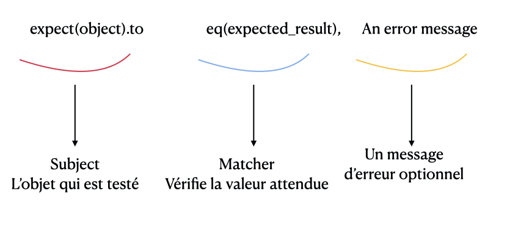

### Des objets rspec 

- Une ligne d'assertion se compose de 3 parties : 

- Si nous testons ces éléments en console : 


require 'rspec/expectation'
include matchers 
foo = 'foo'



#On assigne à une variable expect(foo):
expect_foo = expect(foo)
<RSpec::Expectations::ExpectationTarget:0x00007ff85e05e958 @target=foo>


=> expect(objet) renvoit un objet du module ::Expectations qui englobe l'élément à tester, et sur lequel peuvent être appelées les méthodes `to`, `not_to` (ou `to_not` cela marche aussi) 


#On assigne à une variable eq('foo'):
be_foo = eq('foo')
<RSpec::Matchers::BuiltIn::Eq:0x00007ff85e0678c8 @expected='foo'>


=> eq(resultat attendu) renvoit un objet BuiltIn::Eq du module ::Matchers

Les éléments qui composent les assertions sont donc de simples objets ruby

